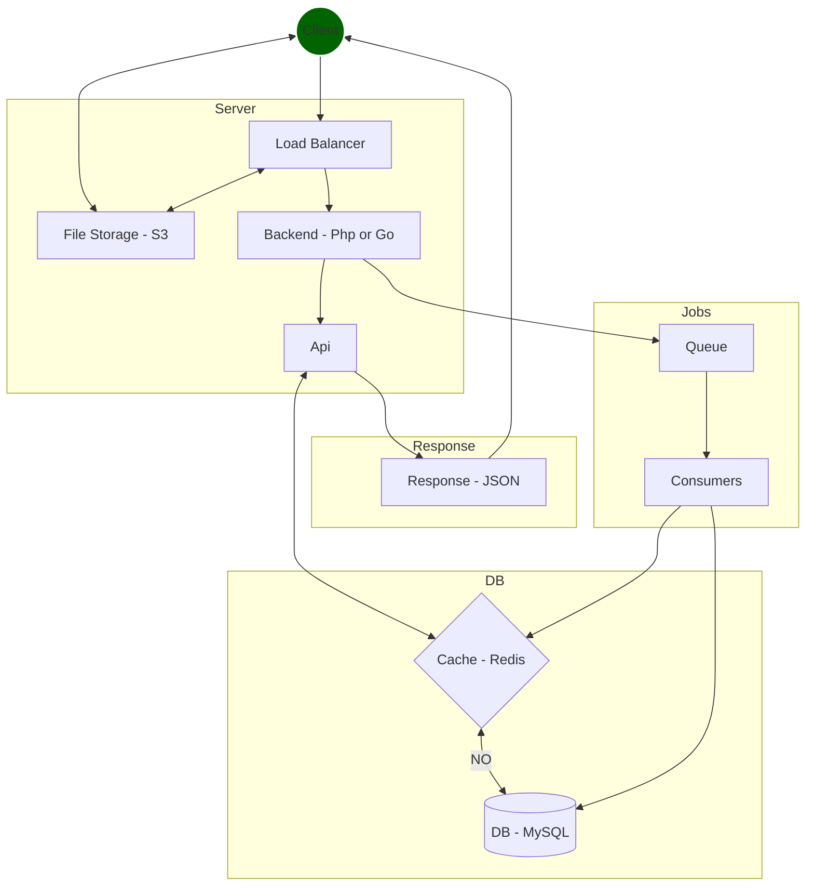

```mermaid
flowchart TB
  style A fill:#006400,stroke:#fff,stroke-width:2px
  A((Client))

  subgraph Response
    K[Response - JSON]
  end

  subgraph Server
    B[Load Balancer]
    C[File Storage - S3]
    D[Backend - Php or Go]
    E[Api]
  end

  subgraph DB
    G{Cache - Redis}
    H[(DB - MySQL)]
  end

  subgraph Jobs
    I[Queue]
    J[Consumers]
  end

  A --> B
  A <--> C
  B <--> C
  B --> D
  D --> E
  E <--> G
  G <-- NO --> H
  D --> I
  K --> A
  I --> J
  E --> K
  J --> H
  J --> G
```
